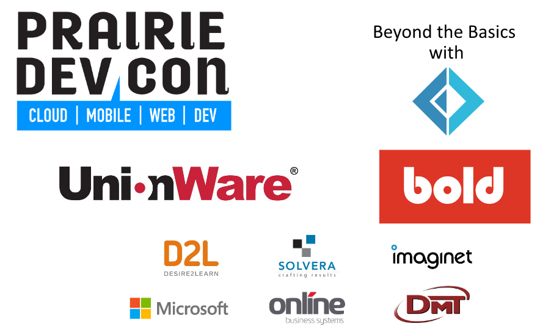

- title : Beyond the Basics with F#
- description : Introduction to F# with some bonus
- author : Shane Charles
- theme : night
- transition : default

***

### Beyond the Basics with F#

***

### Thank the Sponsors

***

### About me

- Shane Charles
- Burning Ice Solutions Inc.
- Functional programming enthusiast
- Board member for Winnipeg .Net UG

    type ContactType = | Email | Twitter | Blog | GitHub

    let getContactInfo = function
      | Twitter -> "@dead_stroke"
      | Blog    -> "http://geekeh.com"
      | GitHub  -> "shanecharles"
      | Email   -> "shanecharles@burningicesolutions.com"

***

### What this talk is about

- What is F#
- Basics
- Active Patterns
- Asynchronous
- Extra resources

***

### What is F#

- General purpose programming langauge on .Net
- Member of the ML family
- Began as a research project out of Microsoft
 
***

### Defining a function

    let printName name = printfn "Hello %s" name

---

### Discriminated Union

    type Cattitude =
        | Lazy
        | Grumpy of multiplier : int
        | Sarcastic of evidence : string list
        | Indifferent

#### Record 

    type Cat = { name : string; mood : Cattitude }

---

### F# is all Class

    type Cat (name : string, mood : Cattitude) =
        let mutable mood = mood
        member x.Name = name
        member x.Mood 
            with get() = mood
            and set(value) = mood <- value

        override x.ToString() =
            sprintf "%s is %A" x.Name x.Mood

***

### Linq'ish

- Higher order functions over collections
- This might seem familiar for some reason

---

### What's in a name

    Seq.map        // Select
    Seq.filter     // Where
    Seq.collect    // SelectMany
    Seq.sortBy     // OrderBy
    Seq.fold       // Aggregate
    Seq.choose     // where + select
    Seq.unfold     // ¯\_(ツ)_/¯

***

### Pattern Matching

- 16 types of matches out of the box
- `match ... with`
- Can use patterns in function signature
- Extensible with Active Patterns

***

### Asynchronous Programming

- Based on workflows
- Wrap the asynchronous code in `async { ... }`
- Bang notation

***

### Summary

- 

***

### Extra Resources

- F# for Fun and Profit (https://fsharpforfunandprofit.com)
- Microsoft Project Springfield (http://bit.ly/2jVeDpW)
- Winnipeg .Net Slack

    type ContactType = | Email | Twitter | Blog | GitHub

    let getContactInfo = function
      | Twitter -> "@dead_stroke"
      | Blog    -> "http://geekeh.com"
      | GitHub  -> "shanecharles"
      | Email   -> "shane_charles@outlook.com"

***
